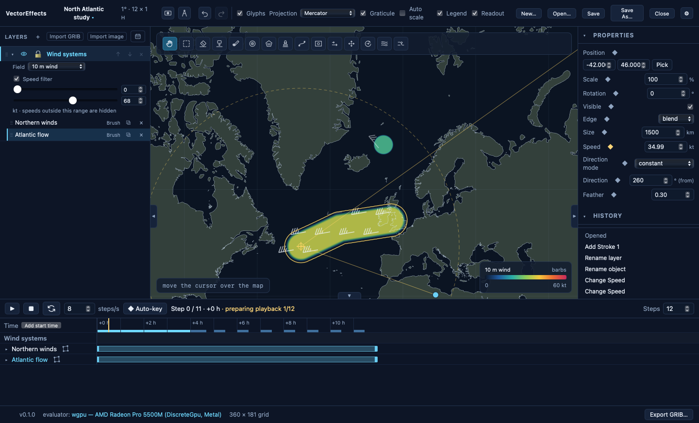

# VectorEffects

VectorEffects allows you to create grib forecasts by editing or creating vector fields for both 10m wind and surface currents, 
and exporting them as grib. The purpose of the app is to create test and benchmark data for routing algorithms.
You can easily download historical data within the app, import grib files (even ICON or jpeg compressed gribs), and edit or create
new vector fields using a suite of paint brush, shape fill, and vector edit tools.
When you're ready, export the grib and use it to route in your routing app of choice. 

[Download releases](https://github.com/jweisbaum/VectorEffects/releases) ·
[Build status](https://github.com/jweisbaum/VectorEffects/actions) ·
[Release notes](docs/releases/0.1.10.md)



## Install

[Download releases](https://github.com/jweisbaum/VectorEffects/releases)

Note on Mac that you need to go through the unsigned app permission flow.

**The current beta expires on January 1, 2027.** Initial beta installers are
ad-hoc signed on Mac and unsigned on Windows. Use the app's Help menu or F1 for
the illustrated guide.

## Develop

Install Rust 1.97 or newer, Node.js 22, and the
[Tauri system prerequisites](https://v2.tauri.app/start/prerequisites/).
Run commands from the repository root:

```sh
npm ci
npm run dev
```

Build installers with `npm run build`. The optional WebDriver feature is only
for local automation and is never included in release builds.

Rust owns the project model, animation, rendering, and GRIB encoding. The UI uses
React and TypeScript inside Tauri. See [spec.md](spec.md) for the application
contract, [CLAUDE.md](CLAUDE.md) for development conventions, and the
[release guide](docs/github-release-plan.md) for the four-platform pipeline.

## License

VectorEffects is licensed under the
[PolyForm Noncommercial License 1.0.0](https://polyformproject.org/licenses/noncommercial/1.0.0).
See the linked license for the full terms governing use, modification, and
distribution.

This means you may use the app except for commercial purposes. Commercial purposes include:
- Developers of paid routing software. 
- Professional or paid navigators, crew, or consultants, or as part of a paid contract.
- Commercial forecast providers.
- Licensed captains during a paid delivery or voyage.